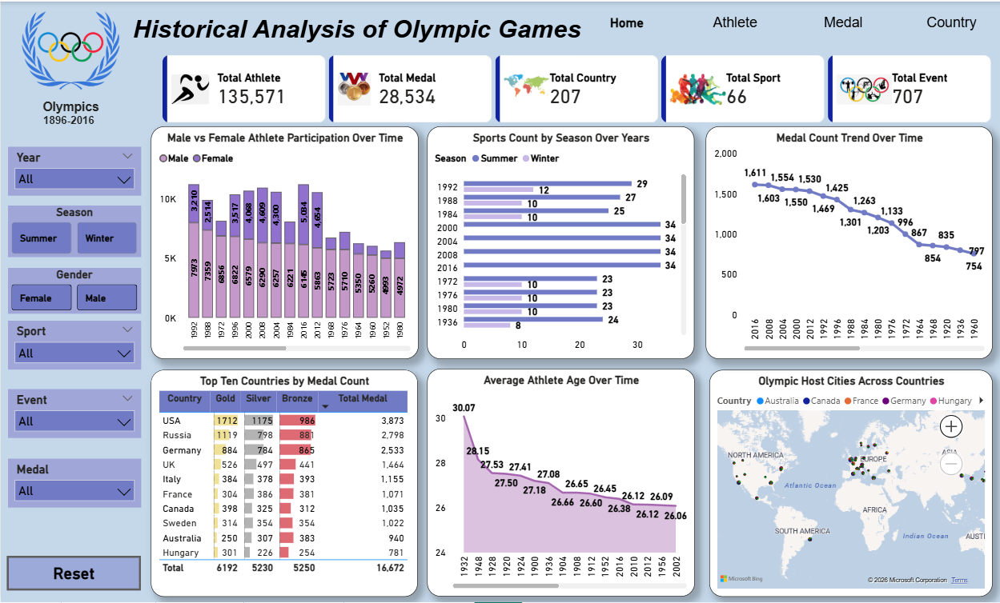
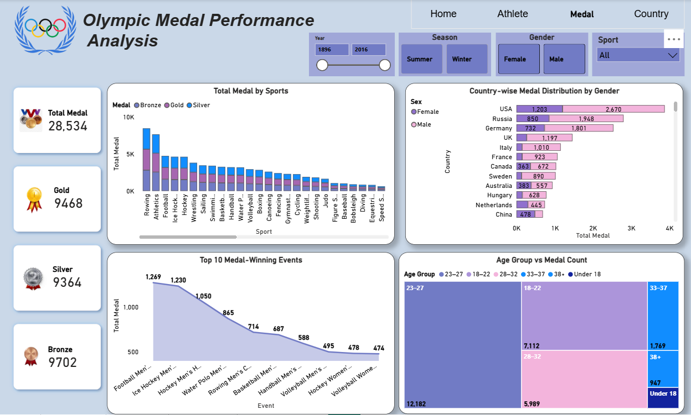
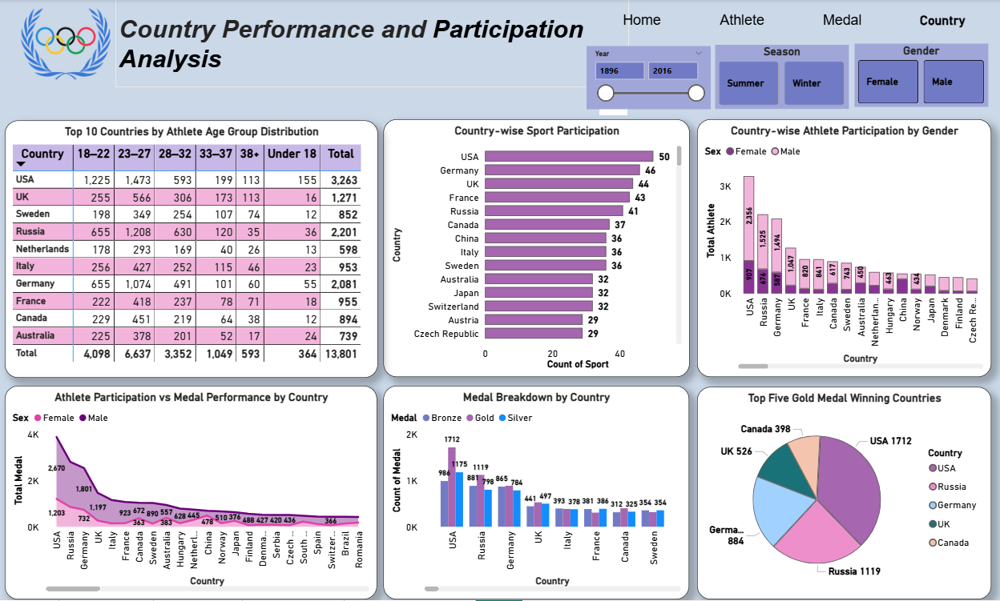

# Olympic Performance & Participation Analysis using Power BI
Interactive Power BI dashboards built on 120 years of Olympic data, providing insights into athlete performance, medal analysis, country dominance, age-group trends, and participation growth over time.

---
🌟 Overview
---

This project presents an interactive Power BI dashboard built using 120 Years of Olympic History (Athletes & Results) data. The goal of this project is to transform raw       historical sports data into meaningful insights that support data-driven storytelling and decision-making.The analysis focuses on  historical trends, athlete performance, medal distribution,country-wise participation, age-based trends, and gender analysis across multiple Olympic editions. Advanced DAX measures,calculated column, Power Query transformations, and data modeling techniques were used to ensure accurate calculations and smooth drill-through navigation between report pages.

  ---
⚡Key Highlights
---
  
- Cleaned and transformed raw data using Power Query
- Built an optimized data model with proper relationships
- Developed DAX measures for medal, athlete, country, sport, and event counts and calculated column for age group
- Designed interactive visuals with drill-through,
   bookmarks and slicers
- Created interactive report pages such as Home, Athlete, Medal,
  Country,
  and enabling detailed insights through drill-through navigation
- Applied best practices in dashboard layout,
  color consistency, and usability

  ---
  🛠 Tools & Technologies
  ---
- Microsoft Excel
- Power BI
- Power Query
- DAX

---
🔍 Key Insights
---
- Olympic participation has increased steadily over time.
- Athlete performance peaks within specific age groups.
- Top-performing countries consistently send the largest number of athletes, boosting their medal potential.
- Medal wins are concentrated among top-performing countries.

  ---
📁 Dataset
---
- athlete_events.csv
- noc_regions.csv

---
📊 Dashboard Preview
---
Home Page
---

Athlete Page
---

Medal Page
---

Country Page
---

